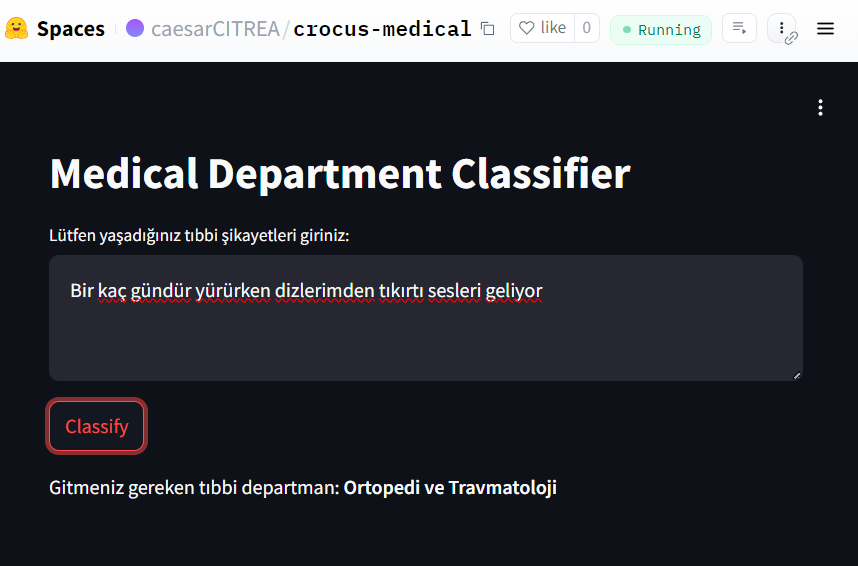

# BERT ile Medikal Departman Sınıflandırıcı



CROCUS Takımı Gururla Sunar!

Bu proje, tıbbi anlamda kişinin durumunu ve şikayetini açıklayan metinler üzerinden bu kişinin hangi tıbbi departmandan hizmet alması gerektiği çıktısını veren bir BERT Temelli Classification modelidir. 

Proje için oluşturduğumuz dataset:
"[caesarCITREA/medikal-departman-57k](https://huggingface.co/datasets/caesarCITREA/medikal-departman-57k)"

Model aynı zamanda huggingface space'e online olarak denenebilmesi için eklenmiştir : "[Modeli online olarak denenebileceği huggingface ortamı](https://huggingface.co/spaces/caesarCITREA/crocus-medical)"

Süreç İçerisinde destek aracı olarak geliştirilen web tool'umuz da submodule olarak eklenmiştir.

## Proje Yapısı

- `main.py`: Modelin yüklenmesi ve tahmin işlemlerinin gerçekleştirildiği dosya.
- `app.py`: FastAPI sunucusunu ve `/model` endpoint'ini uygulayan dosya.
- `request.py`: API'ye istek göndererek modelin nasıl kullanılacağını gösteren örnek bir dosya.
- `requirements.txt`: Projenin çalışması için gerekli olan Python paketlerinin listesi.

## Kurulum ve Çalıştırma

### Gereksinimler

Bu projeyi çalıştırabilmek için aşağıdaki araçların bilgisayarınızda yüklü olması gerekmektedir:

- Python 3.8 veya üzeri
- pip (Python paket yöneticisi)

### Adım Adım Kurulum

1. **Depoyu Kopyalayın**:
   ```bash
   git clone git@github.com:Crocus-AI-Team/crocus-bert-medical-department-classification.git
   cd crocus-bert-medical-department-classification
   ```

2. **Gerekli Paketleri Yükleyin**:
   ```bash
   pip install -r requirements.txt
   ```

3. **API'yi Başlatın**:
   ```bash
   python app.py
   ```
   Bu komut ile FastAPI sunucusu başlatılacak ve API, `http://127.0.0.1:8000` adresinden erişilebilir olacaktır.

## Kullanım

API'yi test etmek için `request.py` dosyasını çalıştırabilirsiniz:

```bash
python request.py
```

Bu script, belirtilen hastalık açıklamasını API'ye gönderir ve API'nin önerdiği departmanı ekrana yazdırır.

## API Detayları

- **Endpoint**: `/model`
- **Yöntem**: `POST`
- **Girdi**: 
  - `text`: Hastanın şikayetini içeren metin (TEXT formatında).
- **Çıktı**:
  - `department`: Hastanın gitmesi gereken departmanın adı (TEXT formatında).

## Örnek İstek

```python
import requests

url = "http://127.0.0.1:8000/model"
description = "Son zamanlarda yürüyüş yaparken dizlerimden daha fazla tıkırdama sesi geliyor."
response = requests.post(url, json={"text": description})

if response.status_code == 200:
    result = response.json()
    print(f"Hasta şu departmana gitmeli: {result['department']}")
else:
    print(f"İstek şu kod ile hata verdi {response.status_code}")
```

## Lisans

Bu proje APACHE2.0 lisansı altında lisanslanmıştır. Daha fazla bilgi için `LICENSE` dosyasına bakınız.
